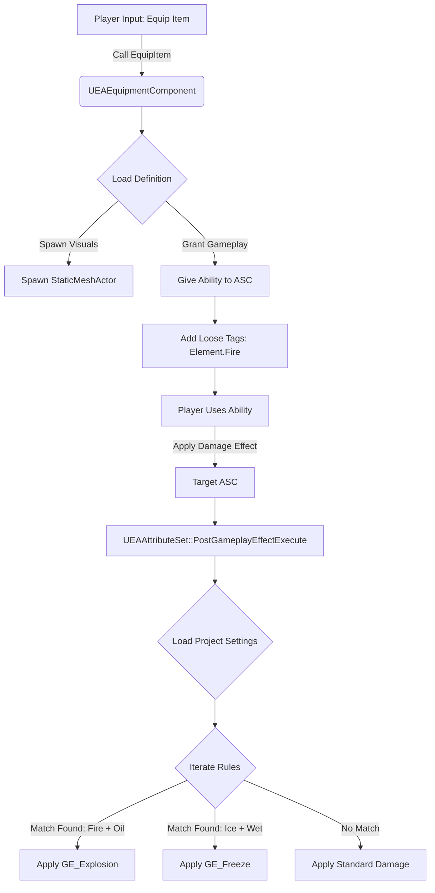
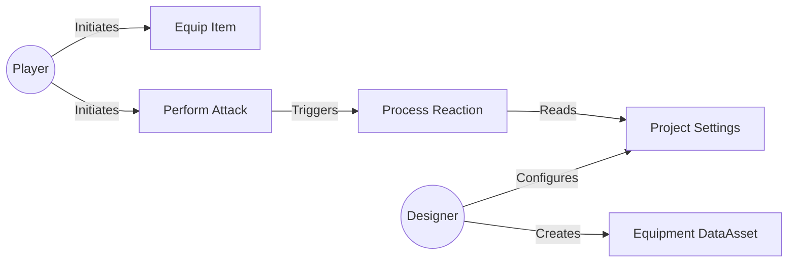
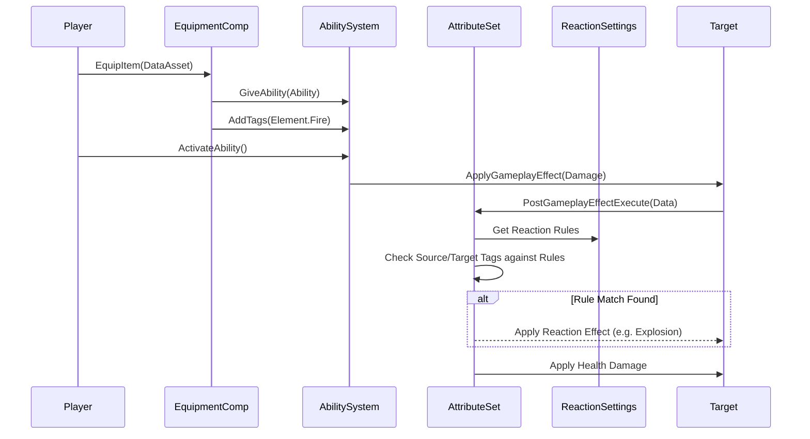

# Elemental Arsenal Plugin

A modular Gameplay Ability System (GAS) plugin for Unreal Engine 5.

## Features

### 1. Data-Driven Equipment System
- **`UEAEquipmentDefinition`**: Data Asset defining visuals, abilities, and elemental tags.
- **`UEAEquipmentComponent`**: Actor Component that handles equipping items, spawning meshes, and managing GAS Ability Specs.
- **Automatic Lifecycle**: Handles granting/revoking abilities and tags when items are equipped/unequipped.

### 2. Configurable Elemental Reactions
- **`UEAReactionSettings`**: Developer Settings configurable via Project Settings. Define rules like `Tag A + Tag B = GameplayEffect C`.
- **`UEAAttributeSet`**: Custom Attribute Set handling Health and Damage.
- **Dynamic Logic**: Intercepts incoming damage in `PostGameplayEffectExecute`, iterates through configured rules, and applies reaction effects dynamically.

### 3. Editor Tools
- **Ability Wizard**: A dedicated editor window to automate the creation of Gameplay Abilities and their associated Gameplay Effects (Cost, Cooldown, Damage).
- **Auto-Wiring**: Automatically links created Gameplay Effects to the Ability Class Defaults (CDO) and applies selected tags.

## System Architecture

### Logic Flow

### Use Case Diagram

### Sequence Diagram

## Setup Guide

1. **Enable Plugin**: Ensure `ElementalArsenal` and `GameplayAbilities` are enabled.
2. **Project Configuration**:
   - Go to **Project Settings** -> **Game** -> **Elemental Arsenal**.
   - Add a Rule: Source Tag (`Element.Fire`) + Target Tag (`Status.Oil`) -> Reaction Effect (`GE_Explosion`).
3. **Character Setup**:
   - Add `UEAEquipmentComponent` to your Character.
   - Ensure your Character implements `IAbilitySystemInterface`.
   - Add `UEAAttributeSet` to your ASC.
   - **Crucial**: Assign a `DefaultDamageEffect` (a GE that adds to `EAAttributeSet.IncomingDamage`) in your Character's blueprint to ensure attacks carry the Instigator context needed for reactions.
4. **Create Content**:
   - Create a Data Asset inheriting from `EAEquipmentDefinition`.
   - Assign a mesh and a Gameplay Ability (e.g., `GA_FireSlash`).
   - Add the tag `Element.Fire` to the Data Asset.
   - **Reaction Effect (GE_Explosion)**:
     - Ensure it removes the Target Tag (e.g., `Status.Oil`) using the **"Remove Other Gameplay Effects"** component (Match Any Tag). This prevents infinite loops.
     - The plugin automatically adds `Effect.Reaction` to prevent recursion, but tag cleanup is gameplay logic you must handle.
5. **Gameplay**:
   - Call `EquipmentComponent->EquipItem(MyDataAsset)`.
   - When you deal damage using the granted ability, the `Element.Fire` tag is passed to the reaction system.

## Tools Guide

### Elemental Ability Wizard
Access via: **Window** -> **Elemental Arsenal** -> **Ability Wizard**.

This tool helps you batch-create assets for a new Ability.
1.  **Name**: Enter the base name (e.g., `FireBall`).
2.  **Parent Ability**: Select your base Gameplay Ability class.
3.  **Ability Tags**: Add tags (e.g., `Ability.Element.Fire`) that this ability should have.
4.  **Components**:
    *   **Cost GE**: Creates `GE_FireBall_Cost`.
    *   **Cooldown GE**: Creates `GE_FireBall_Cooldown`.
    *   **Damage GE**: Creates `GE_FireBall_Damage`.
    *   *Note*: You can select specific parent classes for each GE.
5.  **Generate**: Clicking generate creates all assets in the selected folder and **automatically links** them (sets the Cost/Cooldown classes in the Ability CDO).

## Troubleshooting

- **Infinite Loops / Crashes**: Ensure your Reaction Effect (e.g., `GE_Explosion`) removes the Status tag (e.g., `Status.Oil`) from the victim.
- **Reactions Not Triggering**: Verify that your damage logic uses `AbilitySystemComponent->ApplyGameplayEffectSpecToSelf` (or similar) with a Context that includes the **Instigator** (the attacker). Direct attribute modification often misses this context.

## Dependencies
- GameplayAbilities
- GameplayTags
- GameplayTasks